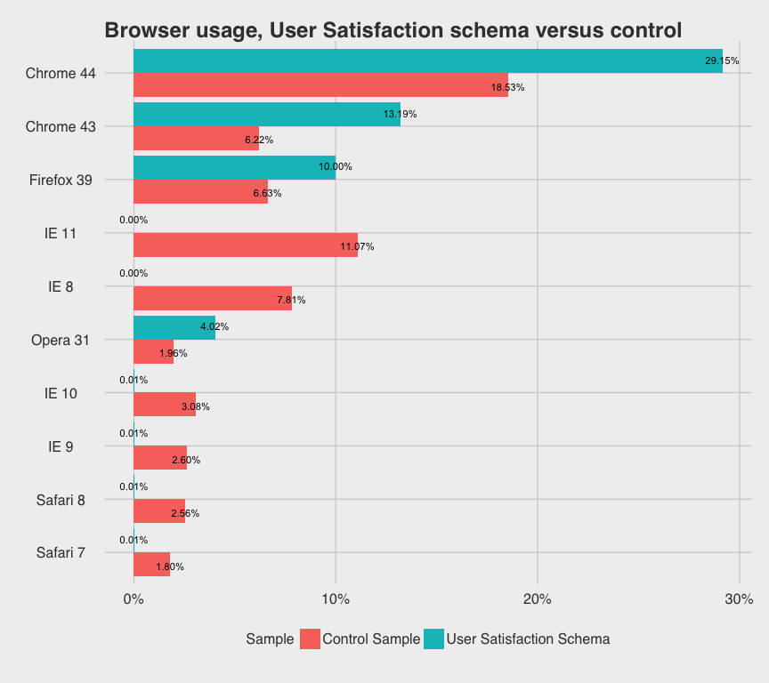
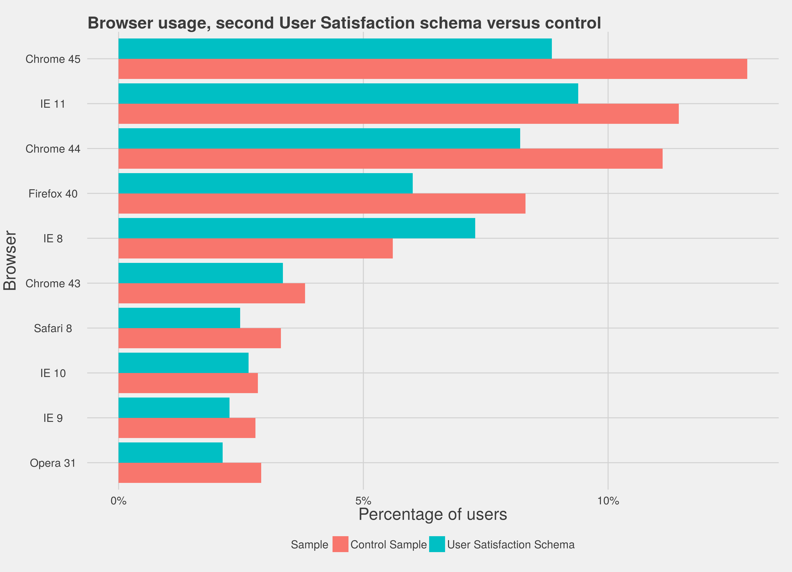
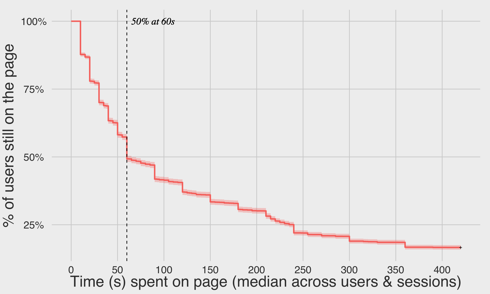
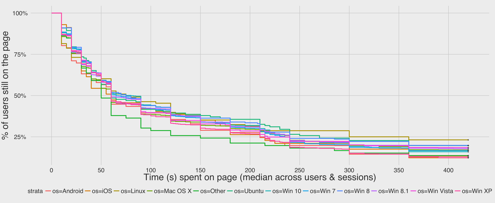
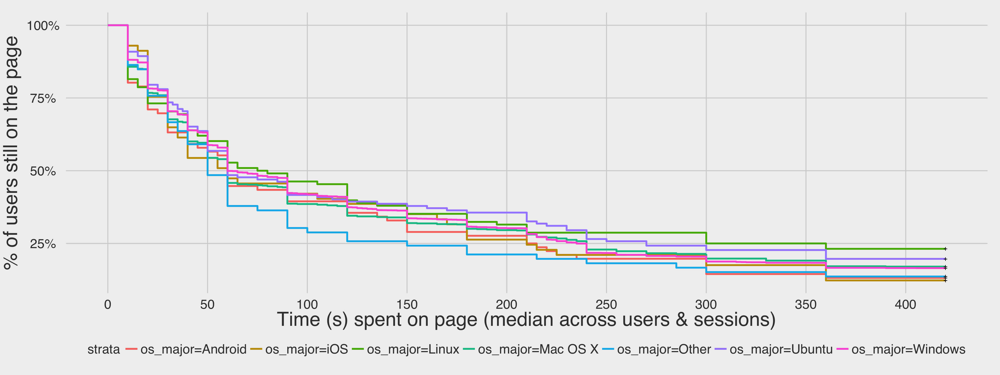
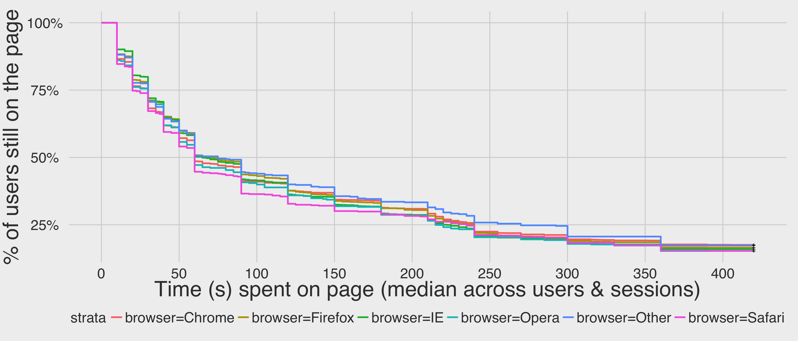
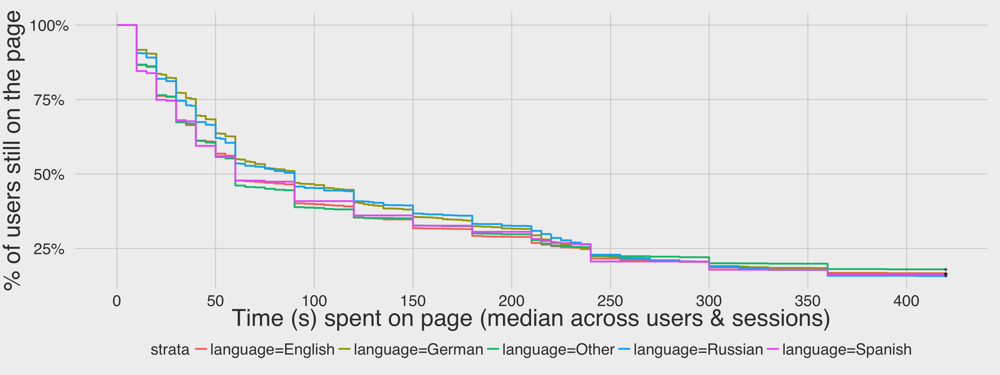
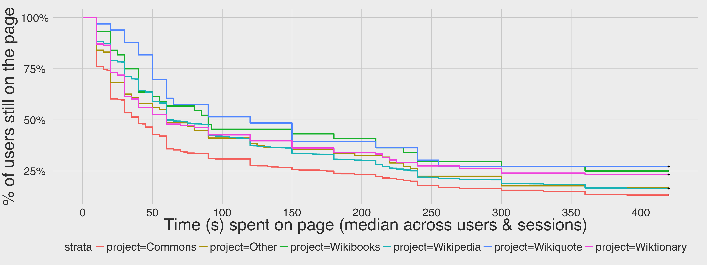
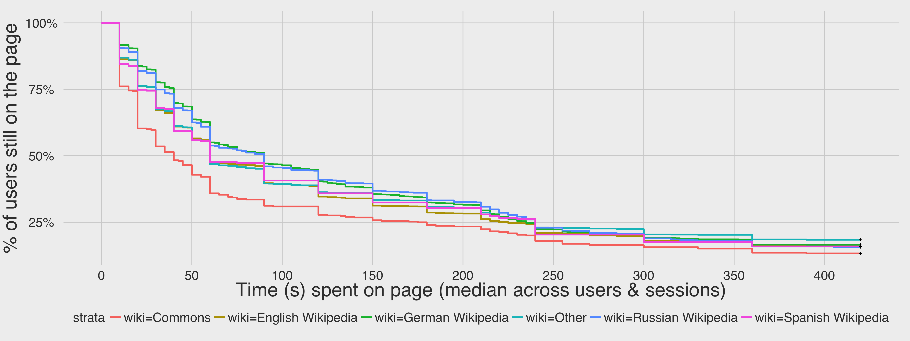

```{r setup, include=FALSE}
rmarkdown::pandoc_latex_engine_args("xelatex")
knitr::opts_chunk$set(echo = FALSE, warning = FALSE, message = FALSE)
# Uses Metropolis beamer theme: https://github.com/matze/mtheme
# Depends on Fire Sans font to be installed
#   See: https://github.com/matze/mtheme/blob/master/getFiraFont.sh
```

## Initial schema

\center



Strict JavaScript requirements in __[v1](https://meta.wikimedia.org/wiki/Schema:TestSearchSatisfaction)__ biased sampling.

## Revised schema



Logged nearly 300,000 events from 10,211 sessions with __[v2](https://meta.wikimedia.org/wiki/Schema:TestSearchSatisfaction2)__.

## Results



The first quarter of users closed the page within the first 25s, and after a minute, we have lost 1/2 of our users.

----



A greater fraction of Linux users kept the pages open for at least 420s than users on any other OS.

----



Combined the fragmented Windows sub-populations into a single Windows group.

* Retained a greater fraction of Linux and Ubuntu users past 400s.
* Lost Android and iOS users faster than on other platforms.

----



* Users across the various browsers behaved similarly.
* The big exception is Safari users (pink), who we lose the fastest.

----



Users remained on German and Russian wiki pages longer than on wikis in other languages.

----



* Lost users the fastest on Commons (red). By 40s, we have already lost half those users.
* Users viewing Wikiquote (blue) pages stayed on those pages longer than users on others. Didn't lose half users until 120s!

----



* Users of Russian and German Wikipedias stayed on those pages longer.
* Spanish and English Wikipedias (along with other wikis) very similar.

## Discussion

Already a valid schema that yields useful data.

Proposed improvements:

  * Log scroll events
    * Ping server if user has scrolled in the last 30-60s.
    * Can be used later to make check-ins more robust.
  * Record additional data for events already in schema:
    1. Number of results returned to user.
    2. Ranking of visited page as it was on SERP.

## Thank you!

### Further reading

* __[Research:Measuring User Search Satisfaction](https://meta.wikimedia.org/wiki/Research:Measuring_User_Search_Satisfaction)__ on Meta
* __[Survival analysis](https://en.wikipedia.org/wiki/Survival_analysis)__ on Wikipedia
* __[Kaplan-Meier estimator](https://en.wikipedia.org/wiki/Kaplan%E2%80%93Meier_estimator)__ on Wikipedia

### Open source

* __[This analysis](https://github.com/wikimedia-research/UserSatisfaction/tree/master/T112269_survanalysis)__ on GitHub
* __[Satisfaction research codebase](https://github.com/wikimedia-research/UserSatisfaction)__ on GitHub
