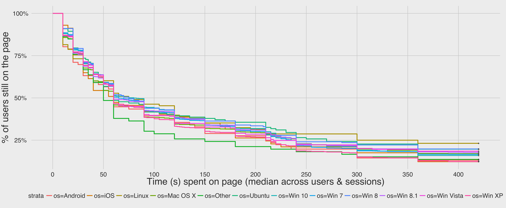
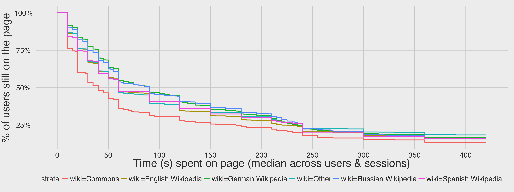

# User Satisfaction Schema: Page Visit Times
Mikhail Popov  
September 15, 2015  

## Background and Methods

This analysis [T112269](https://phabricator.wikimedia.org/T112269) is related to our ongoing [User Satisfaction research](https://meta.wikimedia.org/wiki/Research:Measuring_User_Search_Satisfaction). In July 2015 we began experimenting with [Satisfaction Schema 1.0.0](https://meta.wikimedia.org/wiki/Schema:TestSearchSatisfaction) which was designed to track when the user has left the page. However, we found that the strict Javascript requirements of 2version 1.0 of the schema biased our sample towards certain browsers.

[Satisfaction Schema 2.0.0](https://meta.wikimedia.org/wiki/Schema:TestSearchSatisfaction2)

## Results

### Sampling Bias Check

### Survival Analysis

When a user closes the page and the last ping we have from them is 40s, then we know that they were on the page between 40 and 50 seconds. This is where survival analysis comes in. In statistics, *right censoring* occurs when a data point is above a certain value but it is unknown by how much. In our dataset, the last check-in is that value.

## Conclusion

## Discussion

### Proposed additions for v2.1.0

We suggest adding a **param** field that takes on context-dependent (unsigned) integer values?

1. If **action** == *searchEngineResultPage* then **param** stores the number of results returned by the search (with an upper bound of, say, 100).
2. If **action** == *visitPage* then **param** stores the index of the clicked the result -- e.g. 1 if the page opened was the 1st one in the results list, 4 if the page was the 4th result listed, etc.
3. If **action** == *checkin* then **param** stores the check-in time (10, 20, 30, etc.).

__Possible questions this may help us answer:__

- Did the users who triggered a *searchEngineResultPage* but no *visitPage*'s even get any pages to go to? If **action** == *searchEngineResultPage* and **param** > 0 but there's no accompanying *visitPage*, then we probably didn't return anything they were looking for. This could be very useful for estimating satisfaction.
- Do users open pages beyond the first 10 that get returned?
- Is the 1st result the one that users spend the most time on? How does the page's ranking in the results list correlate with how long people spend on the page?
- Do users follow a pattern of opening 1st result, being unsatisfied, opening 2nd result, being unsatisfied, opening 3rd...?

This will also help prepare the schema for a future revision where we add a "Did we get you results you're satisfied with?" box -- **action**: *survey*, **param**: -2 ("heck no") or -1 ("not really") or 0 ("unsure") or 1 ("yes") or 2 ("very much!")

## References and Further Reading

* [Survival analysis](https://en.wikipedia.org/wiki/Survival_analysis)
* [Kaplan-Meier estimator](https://en.wikipedia.org/wiki/Kaplan%E2%80%93Meier_estimator)
* Goel, M. K., Khanna, P., & Kishore, J. (2010). [Understanding survival analysis: Kaplan-Meier estimate](http://www.ncbi.nlm.nih.gov/pmc/articles/PMC3059453/). _International Journal of Ayurveda Research_, __1__(4), 274–278. http://doi.org/10.4103/0974-7788.76794
