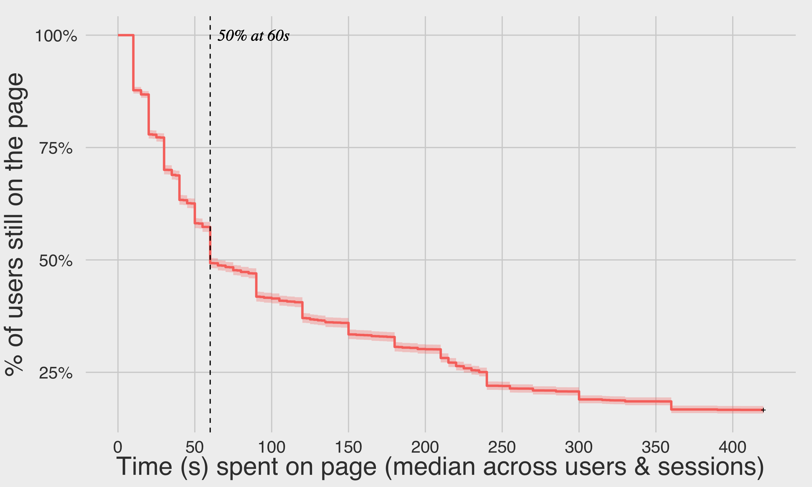
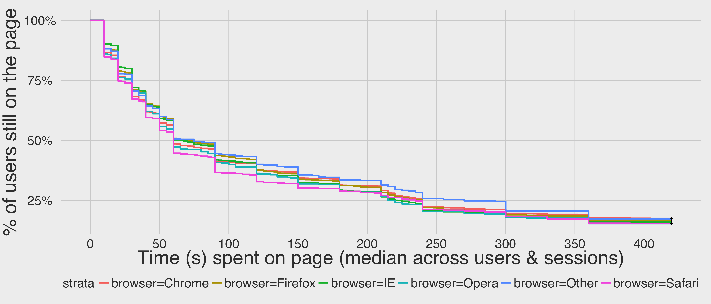
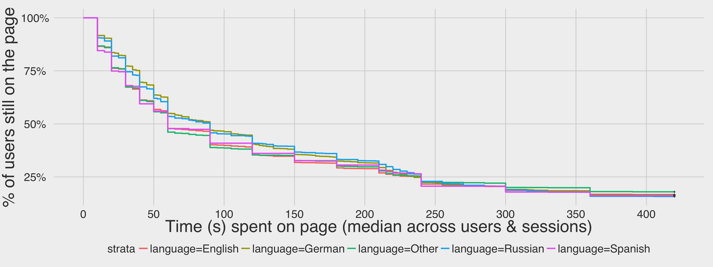

# User Satisfaction Schema: Page Visit Times
Mikhail Popov  
September 15, 2015  

## Background and Methods

This analysis [T112269](https://phabricator.wikimedia.org/T112269) is related to our ongoing [User Satisfaction research](https://meta.wikimedia.org/wiki/Research:Measuring_User_Search_Satisfaction). In July 2015 we began experimenting with [Satisfaction Schema 1.0.0](https://meta.wikimedia.org/wiki/Schema:TestSearchSatisfaction) which was designed to track when the user has left the page (via "on close" trigger). However, we found that the strict JavaScript requirements of version 1.0 of the schema biased our sample towards certain browsers, as shown in Fig. 1.

Thus, we took a pinging approach in the design of [Satisfaction Schema 2.0.0](https://meta.wikimedia.org/wiki/Schema:TestSearchSatisfaction2). The client would check-in at a regular interval and then later we would use statistical methodology for dealing with right-censored data.

## Results

We logged nearly 300,000 events from 10,211 sessions across approximately 5,494 users. A [bug (introduced on September 10th, 2015) in the Event Logging (EL) system](https://lists.wikimedia.org/pipermail/analytics/2015-September/004285.html) prevents us from accurately linking multiple sessions to a same user, so the current number is a rough approximation.

### Sampling Bias Check

Unlike the first (restrictive) version, the revision managed to capture a representative sample of the population that is not biased towards modern browsers, as shown in Fig. 2.

### Survival Analysis

When a user closes the page and the last ping we have from them is 40s, then we know that they were on the page between 40 and 50 seconds. This is where survival analysis comes in. In statistics, *right censoring* occurs when a data point is above a certain value but it is unknown by how much. In our dataset, the last check-in is that value.

*Survival analysis* is concerned with time to event. In epidemiology, that event is usually death, but for us the event is closing the page. Therefore what is technically referred to as *survival*, we refer to as *time spent on page* (TSOP).

*Kaplan-Meier* (K-M) estimate is one of the best options to be used to measure the fraction of subjects (users) without an event (closing the page) for a certain amount of time. K-M estimates enable us to see the percentage of people we lose with each additional second. In Fig. 3, the first quarter of users closed the page within the first 25 seconds, and after a minute, we have lost 50% of our users.

#### Stratification

Next, we wanted to see whether were differences in the time spent on page (TSOP) Kaplan-Meier (KM) curves when stratifying by various user agents fields such as operating system (OS) and browser, and stratifying by project and language. In general, the users in our test dataset behaved very similarly.

![**Figure 8.** TSOP by project. When we stratified by project, that was where we started seeing really stark differences between page visit times. For one, we lost users the fastest on Commons (red), whih makes sense because those pages are not articles that we would expect users to spend several minutes viewing. By 40s, we have already lost half those users. Users viewing Wikiquote (blue) pages, however, stayed on those pages longer than users on others, and it was only by 120s that we have lost half those users. ](figures/survival_proj.png)

## Conclusion

We have a valid (user agent unbiased) schema for tracking sessions and valid statistical methodology (survival analysis) for dealing with the data it generates. Already we can use it to see how user behavior differs between the different wikis, and somewhat between the different languages.

## Discussion

Having said that, we think the schema can be improved to include additional information that would make future analyses more robust and would enable more questions to be answered.

### Proposed additions for v2.1.0

We suggest adding a **param** field that takes on context-dependent (unsigned) integer values?

1. If **action** == *searchEngineResultPage* then **param** stores the number of results returned by the search (with an upper bound of, say, 100).
2. If **action** == *visitPage* then **param** stores the index of the clicked the result -- e.g. 1 if the page opened was the 1st one in the results list, 4 if the page was the 4th result listed, etc.
3. If **action** == *checkin* then **param** stores the check-in time (10, 20, 30, etc.).

__Possible questions this may help us answer:__

- Did the users who triggered a *searchEngineResultPage* but no *visitPage*'s even get any pages to go to? If **action** == *searchEngineResultPage* and **param** > 0 but there's no accompanying *visitPage*, then we probably didn't return anything they were looking for. This could be very useful for estimating satisfaction.
- Do users open pages beyond the first 10 that get returned?
- Is the 1st result the one that users spend the most time on? How does the page's ranking in the results list correlate with how long people spend on the page?
- Do users follow a pattern of opening 1st result, being unsatisfied, opening 2nd result, being unsatisfied, opening 3rd...?

This will also help prepare the schema for a future revision where we add a "Did we get you results you're satisfied with?" box -- **action**: *survey*, **param**: -2 ("heck no") or -1 ("not really") or 0 ("unsure") or 1 ("yes") or 2 ("very much!")

## References and Further Reading

* [Survival analysis](https://en.wikipedia.org/wiki/Survival_analysis)
* [Kaplan-Meier estimator](https://en.wikipedia.org/wiki/Kaplan%E2%80%93Meier_estimator)
* Goel, M. K., Khanna, P., & Kishore, J. (2010). [Understanding survival analysis: Kaplan-Meier estimate](http://www.ncbi.nlm.nih.gov/pmc/articles/PMC3059453/). _International Journal of Ayurveda Research_, __1__(4), 274–278. http://doi.org/10.4103/0974-7788.76794
