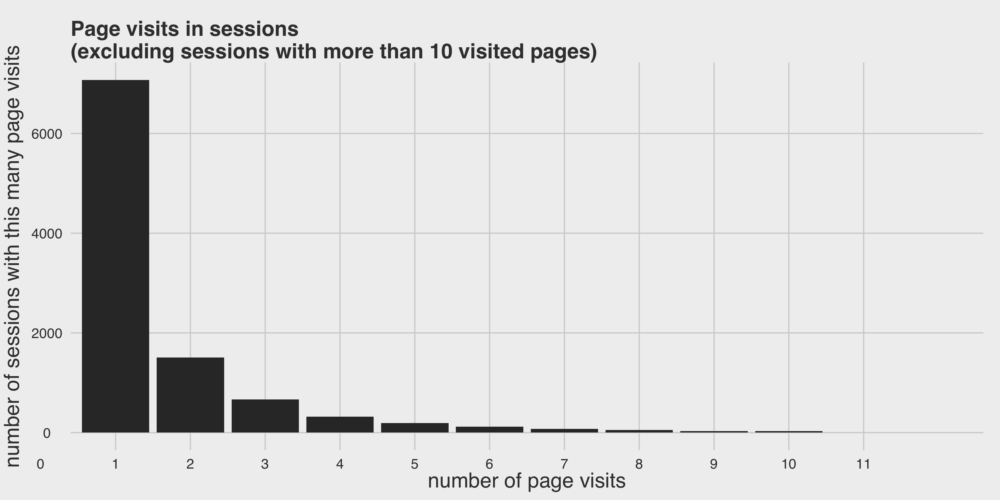
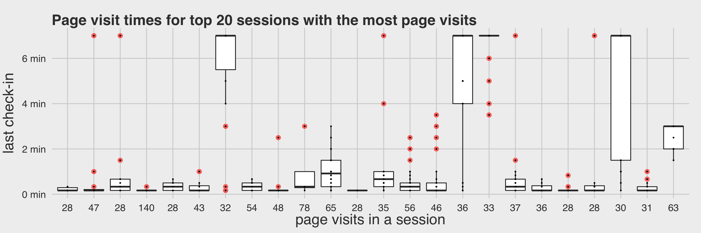
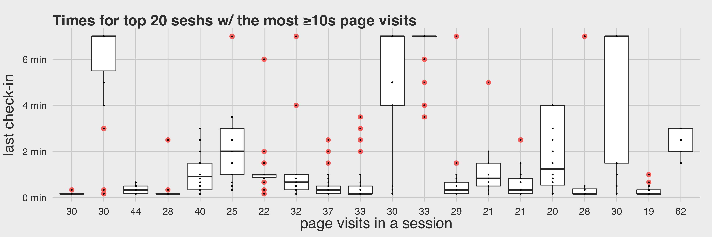
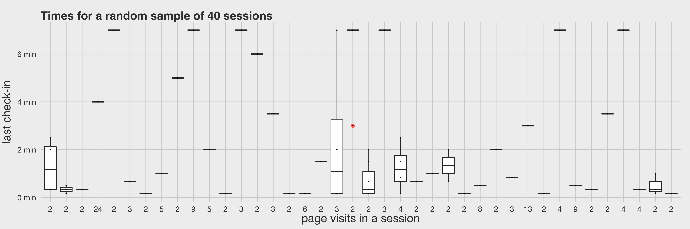
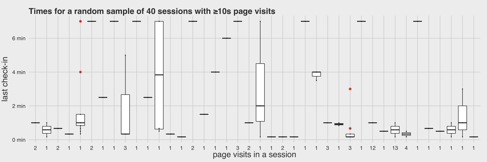

```{r setup, include=FALSE}
knitr::opts_chunk$set(echo = TRUE)
```

## Background

In our ongoing research efforts to develop a measurement of user satisfaction with Search, we had an idea to detect when users had a page visit that deviated from the rest of their page visits in the same search session. The motivating hypothetical was:

1. User searches for a thing.
2. User opens N pages.
3. N-1 page visit times are short (e.g. $\leq 30s$).
4. 1 page visit time is long (e.g. $\geq 2min$).
5. User has probably found a thing they were looking for!

We used the data from the [survival analysis earlier](../T112269_survanalysis).

## Results



We can't really detect outliers in 1-page sessions, and since those account for the majority of our sessions, there is no reason to pursue this idea. At best, we can compute the median and the median absolute deviation (MAD) from the page visit times and then designate page visit times outside of $\text{median} \pm 2 \times MAD$ range as outliers.

\newpage



\vspace{1in}



\newpage



\vspace{1in}



