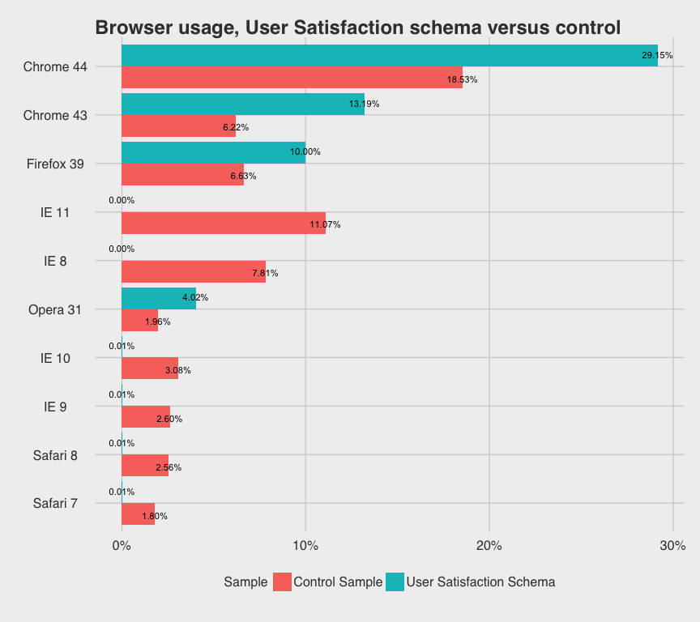
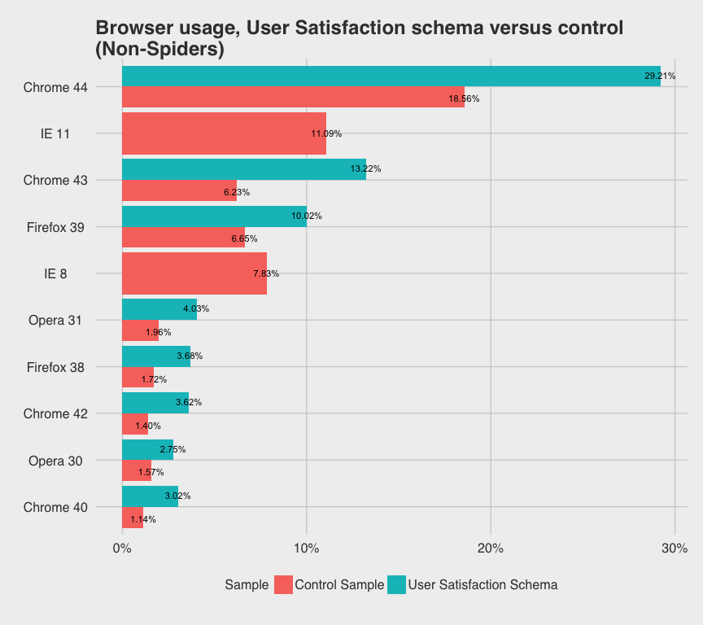
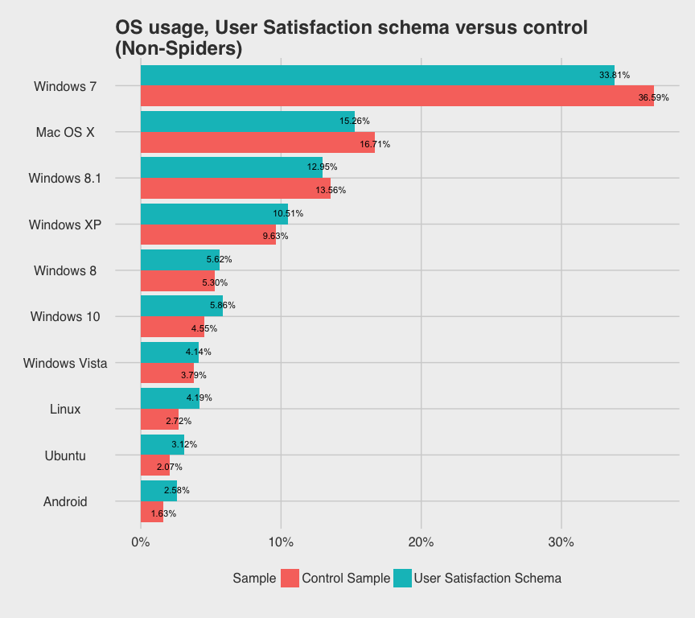
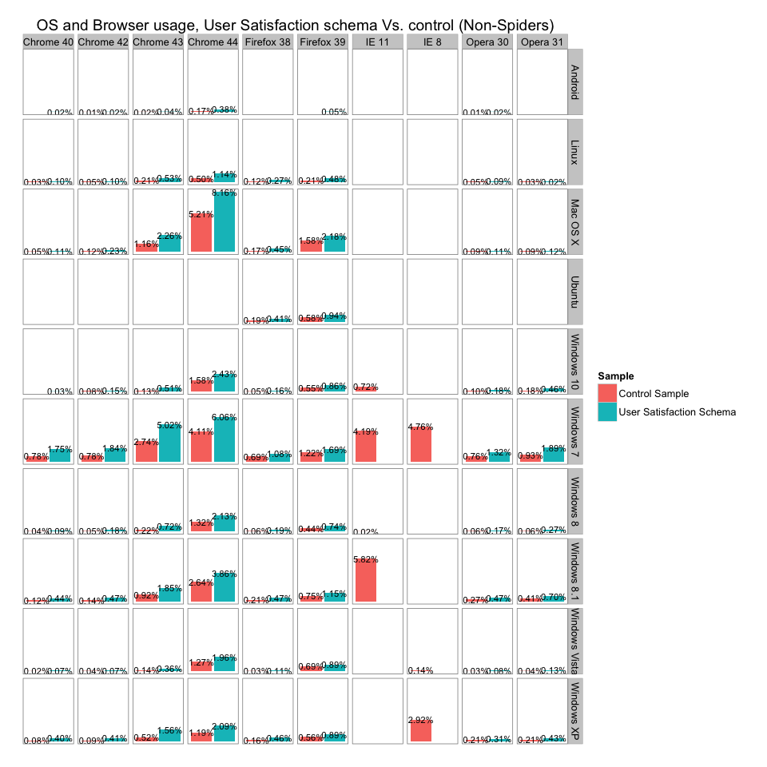
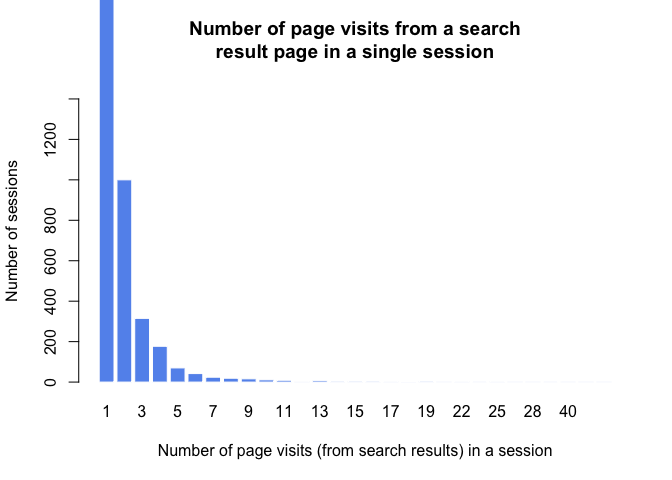
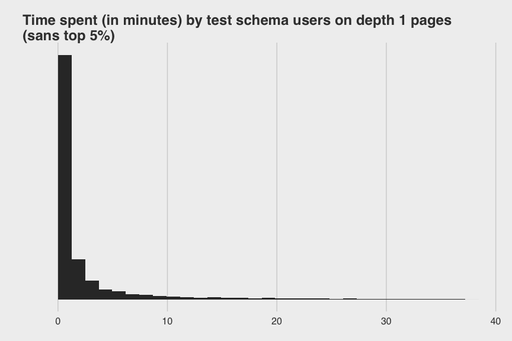
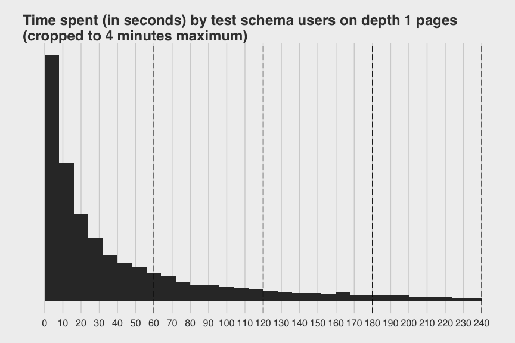
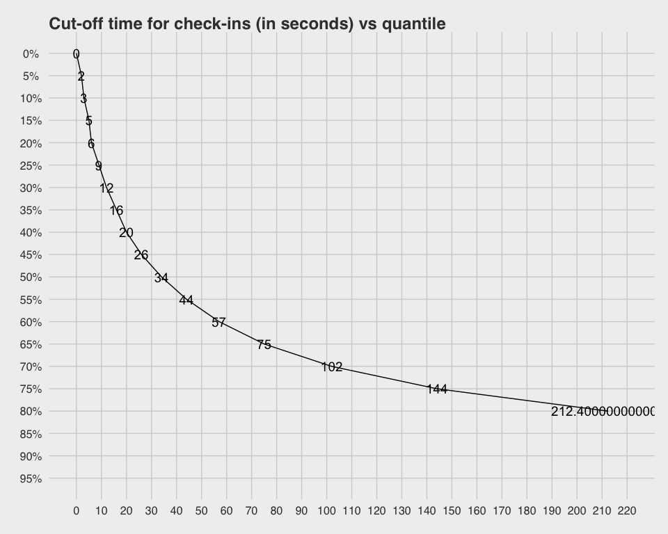

# Initial analysis of the TestSearchSatisfaction data to validate that the theory works
Mikhail Popov  
August 17, 2015  

 This analysis is meant to address the Phabricator task [T105355](https://phabricator.wikimedia.org/T105355).

## Prerequisities

This notebook uses the following packages: magrittr, tidyr, dplyr, knitr, ggplot2, ggthemes, scales, and printr.


## Data Preparation

Oliver Keyes prepared the data for analysis (read it in, cleaned up timestamps, and parsed user agents).


```r
# setwd('analysis_T105355')
load('second_ab_run_tbl-df.RData')
```

## Notes to self

### control_data

|control_data               |comment                          |
|:--------------------------|:--------------------------------|
|uuid                       |Unique user ID
|clientIp                   ||
|timestamp                  ||
|userAgent                  ||
|webHost                    ||
|wiki                       ||
|event_action               ||
|event_clickIndex           ||
|event_numberOfResults      ||
|event_platform             ||
|event_resultSetType        ||
|event_searchSessionToken   ||
|event_timeOffsetSinceStart ||
|event_timeToDisplayResults ||
|event_userSessionToken     ||

### hyp_data (hypothesis data)

|column name           | comment                      |
|:---------------------|:-----------------------------|
|uuid                  ||
|clientIp              ||
|timestamp             ||
|userAgent             ||
|webHost               ||
|wiki                  ||
|event_action          | Identifies the context in which the event was created. When the user clicks a link in the results a visitPage event is created. |
|event_depth           | Records how many clicks away from the search page the user currently is. |
|event_logId           | A unique identifier generated per event. |
|event_pageId          | A unique identifier generated per visited page. This allows a visitPage event to be correlated with a leavePage event. |
|event_searchSessionId | A unique identifier generated per search session. |
|device                     ||
|os                         ||
|os_major                   ||
|os_minor                   ||
|os_patch                   ||
|os_patch_minor             ||
|browser                    ||
|browser_major              ||
|browser_minor              ||
|browser_patch              ||
|browser_patch_minor        ||

## Bias Checking

 

Let's take a look at proportions of (known) spiders in our datasets...


Controls   Hypothesis 
---------  -----------
0.008%     0.022%     


 

 

 

## Analysis

 


16122 visits to pages from 94751 search result pages (17.015%) under [Schema:TestSearchSatisfaction](https://meta.wikimedia.org/wiki/Schema:TestSearchSatisfaction)


20682 visits to pages from 224976 search result pages (9.193%) under [Schema:Search](https://meta.wikimedia.org/wiki/Schema:Search)


2-sample test for equality of proportions (17.015% vs 9.193%): p < 0.001

95% CI for difference of proportions: (-8.1%, -7.6%)

<p style="color: orange; font-size: large;">These are without taking into account a user opening multiple tabs from the search results page.</p>

### Time spent on pages


```r
hyp_pageVisitTimes <- hyp_data %>%
  keep_where((event_action == "visitPage" & event_depth == 1) | event_action == "leavePage") %>%
  arrange(event_searchSessionId) %>%
  group_by(event_pageId) %>%
  summarise(n = n()) %>%
  keep_where(n == 2) %>%
  select(event_pageId) %>%
  left_join(hyp_data, by = "event_pageId") %>%
  select(c(event_pageId, event_action, timestamp, device, os, browser, event_searchSessionId)) %>%
  mutate(timestamp = as.character(timestamp)) %>%
  arrange(event_pageId, desc(event_action)) %>%
  { .[!duplicated(.[, c('event_pageId','event_action')]), ] } %>%
  tidyr::spread(event_action, timestamp) %>%
  mutate(leavePage = lubridate::ymd_hms(leavePage),
         visitPage = lubridate::ymd_hms(visitPage))
```

Note that some **leavePage** events may be duplicated:

|event_pageId     |event_action |timestamp           |device |os          |browser |event_searchSessionId |
|:----------------|:------------|:-------------------|:------|:-----------|:-------|:---------------------|
|1910fc0a7b166ebb |leavePage    |2015-08-09 12:24:09 |Other  |Windows 7   |Chrome  |52d5a92c39058011      |
|1910fc0a7b166ebb |leavePage    |2015-08-09 12:24:12 |Other  |Windows 7   |Chrome  |52d5a92c39058011      |
|88a1d4a587e13d37 |leavePage    |2015-08-08 07:46:02 |Other  |Windows 8.1 |Chrome  |de5f532a31d6ee91      |
|88a1d4a587e13d37 |leavePage    |2015-08-08 07:46:09 |Other  |Windows 8.1 |Chrome  |de5f532a31d6ee91      |

 

 

When we look at the quantiles:

 

For example, if we were to set a check-in at 10s, we would have lost 25% of the users.

We may be able to find out some intelligent way of saying "okay, given that this user with these particular characteristics has been on the page for 20s, what's the probability they're going to be on the page for 30?" and if that probability is low on average, then we don't need to have a check-in at 30s because that's not as useful to us as we originally would have thought.

#### Survival Analysis...


```r
survival::Surv()
survival::survfit()
```
